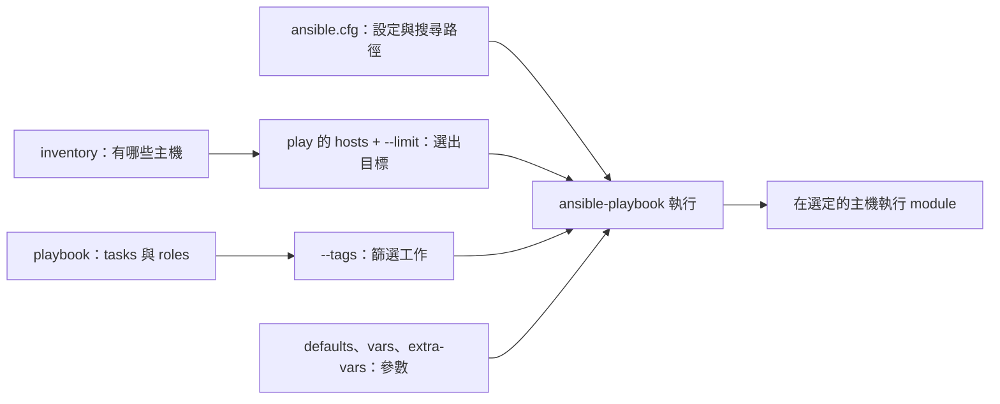

# Ansible 基礎：知道會對誰、做什麼，再開始執行

一次 Ansible 執行，可以先看成三個選擇：**用哪一份專案設定、對哪些主機、執行哪些工作**。lazyansible 把這些選擇放進同一個畫面；底下仍然是 Ansible 的 inventory、playbook 和執行規則。

## 先認識幾個會一直看到的名字

安裝並啟動 Ansible 的電腦叫 **control node（控制端）**；被管理的電腦叫 **managed node**。兩者可以是同一台電腦，例如管理自己的 macOS 或 Ubuntu。管理遠端 Linux 時常用 SSH，通常不必在遠端安裝 Ansible 本身。[官方基本概念](https://docs.ansible.com/projects/ansible/latest/getting_started/basic_concepts.html)

| 名稱 | 回答的問題 | 例子 |
| --- | --- | --- |
| Inventory | 有哪些主機、如何連線、屬於哪些群組？ | `localhost`、`web` 群組、SSH 使用者 |
| Playbook | 要依什麼順序做哪些工作？ | `site.yml`、`playbooks/macos.yml` |
| Play / task | 哪群主機要執行哪個動作？ | 一個 play 的 `hosts: local`，裡面有多個 task |
| Module | 這個 task 具體用什麼功能？ | `ansible.builtin.debug` 顯示訊息 |
| Vars | 這次執行帶入哪些參數？ | 訊息、套件清單、服務設定 |
| Role | 哪些工作和相關檔案可以一起重用？ | `roles/demo/` 裡的 tasks、defaults、templates |
| Tags | 這次只想挑哪些有標籤的工作？ | `greeting`、`summary` |

Playbook 是由一個或多個 play 組成；play 把主機與 tasks／roles 接起來。Role 是可重用的內容組織方式，不是另一種主機。這些關係可以先理解成：**inventory 提供候選主機，play 的 `hosts:` 選目標，tasks／roles 描述工作，vars 提供參數**。[官方 playbook 說明](https://docs.ansible.com/projects/ansible/latest/playbook_guide/playbooks_intro.html)



## 從一個只顯示訊息的專案開始

本 repo 的 [testdata/tutorial](../testdata/tutorial/) 已放好完整範例。它關閉自動收集 facts，所有 task 都使用 `debug`，沒有安裝套件或修改檔案的 task。

```text
testdata/tutorial/
├── ansible.cfg
├── inventory.ini
├── site.yml
└── roles/demo/
    ├── defaults/main.yml
    └── tasks/main.yml
```

[ansible.cfg](../testdata/tutorial/ansible.cfg) 為這份專案指定 inventory 和 role 搜尋位置：

```ini
[defaults]
inventory = ./inventory.ini
roles_path = ./roles
```

[inventory.ini](../testdata/tutorial/inventory.ini) 明確宣告一個 `local` 群組，以及使用本機連線的 `localhost`：

```ini
[local]
localhost ansible_connection=local
```

這裡的 `ansible_connection=local` 表示使用本機連線，不經 SSH。Ansible 也有「implicit localhost」機制，但那個隱含主機不會被 `all` 等群組模式選中；明確寫入 inventory 才會依一般群組規則運作。因此剛開始練習時，把 localhost 寫清楚比較容易理解結果。[官方 localhost 說明](https://docs.ansible.com/projects/ansible/latest/inventory_guide/implicit_localhost.html)

[site.yml](../testdata/tutorial/site.yml) 把 inventory、變數、role 和 tags 接起來：

```yaml
- name: Learn inventory, roles and tags
  hosts: local
  gather_facts: false
  vars:
    demo_message: Message supplied by site.yml
  roles:
    - role: demo
      tags: [greeting]
  tasks:
    - name: Show the summary task
      ansible.builtin.debug:
        msg: This task has the summary tag
      tags: [summary]
```

Role 的 [tasks/main.yml](../testdata/tutorial/roles/demo/tasks/main.yml) 只有一個顯示 `demo_message` 的 task；它的關鍵內容是：

```yaml
- name: Print the selected message
  ansible.builtin.debug:
    msg: "{{ demo_message }}"
```

[defaults/main.yml](../testdata/tutorial/roles/demo/defaults/main.yml) 提供預設值：

```yaml
demo_message: Default message from role demo
```

Role 會依慣例載入 `tasks/main.yml`、`defaults/main.yml` 等檔案；用不到的 role 子目錄可以省略。[官方 role 結構](https://docs.ansible.com/projects/ansible/latest/playbook_guide/playbooks_reuse_roles.html)

這份 playbook 的 `vars` 會覆蓋 role defaults，所以執行 `site.yml` 時會看到 `Message supplied by site.yml`。如果再用 `-e demo_message=Hello`，extra vars 又會覆蓋前面的值。先記住這個例子即可，遇到實際衝突時再查完整 precedence 表。[官方變數優先序](https://docs.ansible.com/projects/ansible/latest/playbook_guide/playbooks_variables.html#understanding-variable-precedence)

從 **lazyansible repo 根目錄** 執行下面這段。括號建立子 shell，範例結束後不會留下工作目錄或 `ANSIBLE_CONFIG` 的變更：

```sh
(
  cd testdata/tutorial || exit
  export ANSIBLE_CONFIG="$PWD/ansible.cfg"

  ansible --version
  ansible-inventory --graph
  ansible-playbook site.yml --syntax-check
  ansible-playbook site.yml --list-hosts
  ansible-playbook site.yml --list-tags
  ansible-playbook site.yml --list-tasks

  # 實際執行這份 debug-only 範例中的 greeting 工作
  ansible-playbook site.yml --tags greeting --limit localhost
)
```

預期 inventory 裡會看到 `local → localhost`；tags 有 `greeting` 和 `summary`；最後只顯示 role 的訊息，不執行 `summary` task。

`--syntax-check`、`--list-hosts`、`--list-tags`、`--list-tasks` 用來檢查或列出內容，不執行 playbook tasks。它們仍需載入專案與 inventory；動態 include 的完整內容也可能要到執行時才能確定，不能把靜態清單當成完整的執行預測。[官方命令選項](https://docs.ansible.com/projects/ansible/latest/cli/ansible-playbook.html)、[tags 與動態重用的限制](https://docs.ansible.com/projects/ansible/latest/playbook_guide/playbooks_tags.html)

## 調整範圍：主機、tags、變數各管一件事

在上面的子 shell 裡，最後一行可以換成以下任一例子：

| 指令 | 在這份範例中的結果 |
| --- | --- |
| `ansible-playbook site.yml` | 執行 demo role 和 summary task |
| `ansible-playbook site.yml --tags greeting` | 只執行標成 greeting 的 role tasks |
| `ansible-playbook site.yml --tags summary` | 只執行 summary task |
| `ansible-playbook site.yml --tags greeting -e demo_message=Hello` | role 顯示 `Hello` |
| `ansible-playbook site.yml --limit localhost` | 在 play 原本的 local 主機中，再限縮為 localhost |

`--limit` 是對 play 的 `hosts:` **再取交集**，不會改寫 play 的目標。如果 play 寫 `hosts: web`，`--limit db01` 也不會把一台不屬於 `web` 的資料庫主機拉進來。[官方主機模式](https://docs.ansible.com/projects/ansible/latest/inventory_guide/intro_patterns.html)、[`--limit` 選項](https://docs.ansible.com/projects/ansible/latest/cli/ansible-playbook.html)

`--tags` 則是篩選有對應標籤的工作，**不會因為某個 role 叫 `demo`，就自動把 `--tags demo` 當成「執行 demo role」**。範例刻意讓 role 名稱是 `demo`、tag 是 `greeting`。這裡透過 play 的 `roles:` 指定 tag，role 內的 tasks 會繼承它；動態 `include_role` 的 tag 規則不同，之後遇到再查。[官方 tags 說明](https://docs.ansible.com/projects/ansible/latest/playbook_guide/playbooks_tags.html)

接觸會修改系統的 playbook 時，常會先加 `--check --diff`。`--check` 是模組支援範圍內的模擬，不能保證完整或沒有變更：task 可以用 `check_mode: false` 要求正常執行。`--diff` 會顯示支援模組的前後內容，也可能輸出檔案中的敏感資料。先理解所選 tasks，再解讀這兩個選項的結果。[官方 check／diff mode](https://docs.ansible.com/projects/ansible/latest/playbook_guide/playbooks_checkmode.html)

## 原生命令怎麼分工，設定又從哪裡來

`ansible` 是執行一次 ad-hoc task 的程式；`ansible-playbook` 是讀取 playbook 的程式。它們是平行的 executables，`ansible` 不是涵蓋所有功能的 `ansible <subcommand>` 入口。[官方 ad-hoc 說明](https://docs.ansible.com/projects/ansible/latest/command_guide/intro_adhoc.html)

| 想做的事 | 常用原生命令 |
| --- | --- |
| 臨時執行一個 module | `ansible local -m ansible.builtin.debug -a 'msg=Hello'` |
| 執行可重用的工作流程 | `ansible-playbook site.yml` |
| 看 Ansible 解析後的主機與群組 | `ansible-inventory --graph` 或 `--list` |
| 查生效設定 | `ansible-config dump --only-changed` |
| 查某個 module 的用法 | `ansible-doc ansible.builtin.debug` |
| 管理下載的 roles／collections | `ansible-galaxy` |
| 加密或編輯加密的變數檔 | `ansible-vault` |

日常先熟悉 `ansible-playbook`、`ansible-inventory`、`ansible-config` 就足夠開始。`ansible-console` 是互動式命令環境，`ansible-pull` 用於由目標機拉取內容後執行；遇到這些需求時再學即可。[官方命令工具索引](https://docs.ansible.com/projects/ansible/latest/command_guide/command_line_tools.html)

上面的 `debug` 例子只驗證選擇目標、參數與顯示流程；它不是 SSH 連線測試。

Ansible 尋找設定檔的順序如下，**使用第一個找到的檔案，不會把這四份檔案全部合併**：

1. `ANSIBLE_CONFIG` 指定的路徑。
2. **目前工作目錄**的 `ansible.cfg`。
3. `~/.ansible.cfg`。
4. `/etc/ansible/ansible.cfg`。

環境變數、命令列與 playbook 變數還有各自的覆蓋規則。先用 `ansible --version` 看它實際選了哪個 config file，再用 `ansible-config dump --only-changed` 查變更值，會比猜檔案位置快。Ansible 不會自動採用 world-writable 工作目錄中的設定檔。[官方設定說明](https://docs.ansible.com/projects/ansible/latest/reference_appendices/config.html)

**工作目錄與 playbook 所在目錄是兩件事。** 例如人在 `/tmp`，即使執行 `ansible-playbook /path/project/site.yml`，也不代表 Ansible 會自動把 `/path/project` 當成 cwd 來找 `ansible.cfg`。設定檔中的許多相對路徑以設定檔為基準；role、template、file 等內容又有依 playbook／role 尋找的規則。因此固定從專案根目錄執行，或明確選設定，會少很多「同一條命令換個地方就不同」的困惑。[官方路徑搜尋說明](https://docs.ansible.com/projects/ansible/latest/playbook_guide/playbook_pathing.html)

`~/.ansible/` 通常提供 roles、collections、暫存資料等預設支援位置；它不是每個專案都必須使用的工作目錄。Ansible 的預設路徑設定不等於專案產生器：安裝 `ansible-core` 不會替你建立 `inventories/localhost.ini` 或 `playbooks/`。另外，`~/.ansible.cfg` 與 `~/.ansible/ansible.cfg` 是不同路徑，後者不在上述全域自動搜尋位置中。[roles 預設位置](https://docs.ansible.com/projects/ansible/latest/reference_appendices/config.html#default-roles-path)、[collections 預設位置](https://docs.ansible.com/projects/ansible/latest/reference_appendices/config.html#collections-paths)、[控制端暫存位置](https://docs.ansible.com/projects/ansible/latest/reference_appendices/config.html#default-local-tmp)

## 這台機器的檔案地圖

本機的 dotfiles 額外把 Ansible 專案部署在 `~/.ansible/`，所以這個目錄同時混合了 **Ansible 支援資料**與**個人專案內容**。只有相應的設定檔、inventory、roles 等來源檔由 chezmoi 管理，不能把整個 `~/.ansible/` 都視為 chezmoi 擁有。

| 位置 | 本機用途與維護來源 |
| --- | --- |
| `$(chezmoi source-path)/dot_ansible/` | 個人 Ansible 專案的 chezmoi 來源；持久修改從這裡做 |
| `~/.ansible/ansible.cfg` | 部署後的專案設定，含 `roles_path = ./roles`、`inventory = ./inventories/localhost.ini`、`stdout_callback = clean` |
| `~/.ansible/inventories/localhost.ini` | 自訂 inventory；來源是 `dot_ansible/inventories/localhost.ini`，不是 Ansible 安裝時產生 |
| `~/.ansible/playbooks/`、`~/.ansible/roles/` | 部署後的個人 playbooks 與 roles |
| `~/.local/share/uv/tools/ansible-core/` | 本機 uv 管理的 Python／Ansible runtime，與上面的專案內容分開 |

本機的 localhost inventory 目前就是範例中的 `[local]` 與 `localhost ansible_connection=local`。要檢查這份真實專案，可以先做以下觀察，不執行它的 tasks：

```sh
(
  cd "$HOME/.ansible" || exit
  export ANSIBLE_CONFIG="$PWD/ansible.cfg"
  ansible --version
  ansible-config dump --only-changed
  ansible-inventory --graph
  ansible-playbook playbooks/macos.yml --list-tags
  ansible-playbook playbooks/macos.yml --list-hosts
)
```

這裡特別選 `~/.ansible/ansible.cfg`，是因為它屬於本機專案；Ansible 不會只因為檔案放在那裡就全域載入。Runtime 的實際安裝位置則可用 `uv tool list --show-paths` 或 `lazyansible runtime status` 查看。

正常 chezmoi 流程還有一層橋接：來源 repo 的 `.chezmoiscripts/global/run_onchange_after_20_ansible_roles.sh.tmpl` 會依偏好組合 tags、extra vars，以及 sudo／noRoot、Python 與 PATH 等執行條件。它是 `run_onchange` 腳本，不是每一次 apply 都無條件執行。

`just ansible-macos` 則直接切到 `~/.ansible` 再執行 `ansible-playbook playbooks/macos.yml`。自己下原生命令或從 lazyansible 手動執行，也不會自動重現前述 chezmoi 橋接的完整選擇。要真正套用 dotfiles 時，應沿用既有操作流程，或先明確核對這次的 tags、extra vars 與權限條件；第一次認識介面請先使用上面的 tutorial。

## 換成 lazyansible 時，哪些概念保持不變

lazyansible 增加的是專案選擇、檢視、操作確認與結果呈現。你仍然需要選對 inventory 和 playbook，也仍然受到 `hosts`、limit、tags、vars 的同一組 Ansible 規則約束。

從本 repo 根目錄，用已建好的本地 binary 開啟相同範例：

```sh
./bin/lazyansible -C testdata/tutorial -i inventory.ini -d .
./bin/lazyansible -C testdata/tutorial -i inventory.ini inspect inventory --json
./bin/lazyansible -C testdata/tutorial -i inventory.ini inspect tags site.yml --json
./bin/lazyansible -C testdata/tutorial -i inventory.ini preview site.yml --tags greeting
./bin/lazyansible -C testdata/tutorial -i inventory.ini run site.yml --tags greeting --dry-run
```

在 lazyansible 中，`-C`／`--chdir` 選工作目錄，`-d` 選擇要掃描 playbook 的目錄。**原生 `ansible-playbook -C` 則是 check mode**，兩個程式的縮寫不同；跨工具時直接寫 `--chdir` 或 `--check` 最清楚。

lazyansible 的 `--dry-run` 只產生並顯示命令計畫，不執行 playbook；`preview` 則呼叫原生 list 選項觀察 hosts/tasks/tags，不執行 playbook tasks；`--check` 才是把 Ansible check mode 傳入實際執行。Inventory／config inspector 可以幫你確認解析結果，但不是所有 task 當下變數與來源的完整證明。

接著可看 [lazyansible 操作指南](lazyansible-guide.zh-TW.md)，或回到 [README](../README.md) 查快捷鍵、XDG 設定和 uv runtime 操作。
